# 重构N P C

## 总体架构

加上总线后的整体架构如下图所示：


由于系统寄存器以及CSR需要与多个模块交互，所以不加入总线通信之中。对于NPC的C语言程序需要对一个输入和两个输出进行控制。

## 模块间交互

总线的交互逻辑如下：

```text
   +-+ valid = 0
   | v         valid = 1
1. idle ----------------> 2. wait_ready <-+
   ^                          |      |    | ready = 0
   +--------------------------+      +----+
              ready = 1
```

具体地:

1. 一开始处于空闲状态idle, 将valid置为无效
   1. 如果不需要发送消息, 则一直处于`idle`状态
   2. 如果需要发送消息, 则将`valid`置为有效, 并进入`wait_ready`状态, 等待slave就绪
2. 在wait_ready状态中, 同时检测slave的ready信号
   1. 如果`ready`信号有效, 则握手成功, 返回`idle`状态
   2. 如果`ready`信号无效, 则继续处于`wait_ready`状态等

### IFU2IDU

IFU与IDU之间需要需要传输的只有指令信号，所以data为指令信号。对于IFU来说，当pc和inst都发生变化时valid有效。对于IDU来说，当valid有效时，ready延迟一个周期有效。

### IDU2EXU

IDU与EXU之间的交互包括两个部分，控制信号和系统寄存器信号，如下表所示。对于IDU来说当与IFU之间的握手成功时，延迟一个周期valid有效。对于EXU来说，当valid有效时，ready延迟一个周期有效。

**数据信号**

- rs1Data[31:0]：rs1字段对应寄存器值。
- rs2Data[31:0]：rs2字段对应寄存器值。
- imm[31:0]：立即数值

**控制信号**

- regWR[0:0]：控制是否对寄存器rd进行写回，为1时写回寄存器，为0不写回。

- srcAALU[1:0]：选择ALU输入端A的来源。为0时选择rs1，为1时选择PC，为2时选择CSR。

- srcBALU[1:0]：选择ALU输入端B的来源。为00时选择rs2，为01时选择imm(当是立即数移位指令时，只有低5位有效)，为10时选择常数4（用于跳转时计算返回地址PC+4）。

- ctrALU[3:0]：选择ALU执行的操作，具体含义参见下表。

- | ctrALU[3] | ctrALU[2:0]} | ALU操作                                                  |
  | --------- | ------------ | -------------------------------------------------------- |
  | 0         | 000          | 选择加法器输出，做加法                                   |
  | 1         | 000          | 选择加法器输出，做减法                                   |
  | ×         | 001          | 选择移位器输出，左移                                     |
  | 0         | 010          | 做减法，选择带符号小于置位结果输出, Less按带符号结果设置 |
  | 1         | 010          | 做减法，选择无符号小于置位结果输出, Less按无符号结果设置 |
  | ×         | 011          | 选择ALU输入B的结果直接输出                               |
  | ×         | 100          | 选择异或输出                                             |
  | 0         | 101          | 选择移位器输出，逻辑右移                                 |
  | 1         | 101          | 选择移位器输出，算术右移                                 |
  | ×         | 110          | 选择逻辑或输出                                           |
  | ×         | 111          | 选择逻辑与输出                                           |

- branch[3:0]：选择跳转的类型，具体含义参见下表。

- | Branch | 跳转类型             |
  | ------ | -------------------- |
  | 0000   | 非跳转指令           |
  | 0001   | 无条件跳转PC目标     |
  | 0010   | 无条件跳转寄存器目标 |
  | 0100   | 条件分支，等于       |
  | 0101   | 条件分支，不等于     |
  | 0110   | 条件分支，小于       |
  | 0111   | 条件分支，大于等于   |
  | 1000   | 异常跳转             |

- toReg[1:0]：选择寄存器rd写回数据来源，为0时选择ALU输出，为1时选择数据存储器输出，为2时选择CSR作为输出。
- memWR[0:0]：控制是否对数据存储器进行写入，为0时不写回，为1时写回存储器。
- memValid[0:0]：控制对存储器操作是否有效，为0时存储器操作无效，为1时操作有效。
- memOP[2:0]：控制数据存储器读写格式，为010时为4字节读写，为001时为2字节读写带符号扩展，为000时为1字节读写带符号扩展，为101时为2字节读写无符号扩展，为100时为1字节读写无符号扩展。
- ecall[0:0]：检测到ecall命令时为1，非ecall时为0。
- mret[0:0]：检测到mret命令时为1，非mret时为0。
- csrEn[0:0]：控制对csr操作是否有效，为0时csr操作无效，为1时操作有效。
- csrWr[0:0]：控制对csr写入，为0时csr不写入，为1时写入。
- csrOP[0:0]：选择CSRALU输入端B的数据来源。为0时选择rs1，为1时选择zimm。
- csrALUOP[1:0]：选择CSRALU的操作。为0时输出两个输入的与非（&～）结果，为1时输出或（|）结果，为2时直接输出B口输入。

### EXU2WBU

EXU与WBU之间的交互包括两个部分，控制信号和系统寄存器信号，如下表所示。对于EXU来说当与WBU之间的握手成功时，延迟一个周期valid有效。对于WBU来说，当valid有效时，ready延迟一个周期有效。

**数据信号**

- memData[31:0]：存储器数据。
- rdData[31:0]：目的寄存器数据。
- csrData[31:0]：csr目的寄存器数据。

**控制信号**

- memWR[0:0]：控制是否对数据存储器进行写入，为0时不写回，为1时写回存储器。
- memValid[0:0]：控制对存储器操作是否有效，为0时存储器操作无效，为1时操作有效。
- memOP[2:0]：控制数据存储器读写格式，为010时为4字节读写，为001时为2字节读写带符号扩展，为000时为1字节读写带符号扩展，为101时为2字节读写无符号扩展，为100时为1字节读写无符号扩展。
- ecall[0:0]：检测到ecall命令时为1，非ecall时为0。
- mret[0:0]：检测到mret命令时为1，非mret时为0。
- csrEn[0:0]：控制对csr操作是否有效，为0时csr操作无效，为1时操作有效。
- csrWr[0:0]：控制对csr写入，为0时csr不写入，为1时写入。

# AXI Transport

下面是AXI协议的传输信号交互

## Clock and reset

### Clock

所有的AXI接口都有单独的时钟信号，所有的输入信号均在上升沿采样，所有输出信号变化只能在时钟上升沿之后。

在Master和Slave接口的输入和输出信号之间不能有组合路径。

### Reset

AXI协议使用单独的低电平有效，**ARESETn**。复位信号可以被异步置高位，但置低位只能被同步地在时钟上升沿置低。

在重置期间适用以下接口要求：

- Master接口必须将**AWVALID**，**WVALID**，**ARVALID**置低。
- Slave接口必须将**BVALID**，**RVALID**置低。
- 其他信号可以被置为任意值。

复位后，允许Master开始驱动 **AWVALID**、**WVALID** 或 **ARVALID**置高位的最早时间点是 **ARESETn** 为高电平后的 ACLK 上升沿。

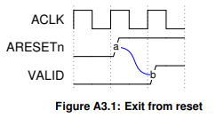

## Channel handshake

源端生成 VALID 信号以指示地址、数据或控制信息何时可用。目标端生成 READY 信号以指示它可以接受信息。仅当 VALID 和 READY 信号都为
高电平时才会发生传输。

对于Master和Slave接口都不允许输入输出信号之间存在组合路径。

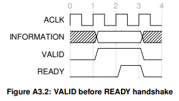

不允许源在 **READY** 置位后才置位**VALID**。

当  **VALID**  置位时，它必须保持置位状态直到发生握手，即在时钟上升沿，**VALID** 和 **READY** 均置位时。

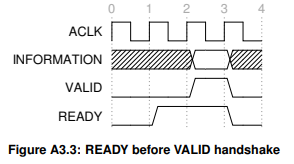

允许目的信号 **VALID** 置位后才置位 **READY** 。

如果 **READY**  被置位，允许 **READY** 在 **VALID** 被置位之前被置低位。

当 **VALID** 和 **READY** 同时置位时，传输发生在下一个上升沿。

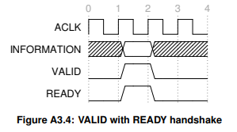

## Write and read channels

### Write request channel (AW)

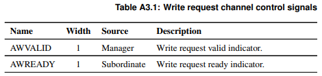

Master仅在驱动有效请求时才可以置位 **AWVALID** 信号。置位后，**AWVALID** 必须保持置位状态，直到下级置位 **AWREADY** 后的时钟上升沿。

**AWREADY** 的默认状态可以是 **HIGH** 或 **LOW**。建议使用 **HIGH** 作为 **AWREADY** 的默认状态。当 **AWREADY** 为 **HIGH** 时，下级必须能够接受向其呈现的任何有效请求。

不建议将 **AWREADY** 默认为低电平，因为这会强制传输至少需要两个周期，一个周期用于断言 **AWVALID**，另一个周期用于断言 **AWREADY**。

### Write data channel (W)

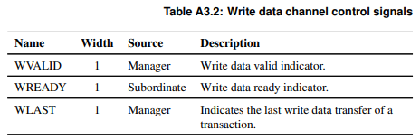

在写入事务期间，Master仅当驱动有效写入数据时才可以断言 **WVALID** 信号。断言后，**WVALID** 必须保持断言状态，直到下级服务器断言 **WREADY** 后的时钟上升沿。

**WREADY** 的默认状态可以为 **HIGH**，但前提是下级设备始终能够在单个周期内接受写入数据。

在驱动事务中的最后一个写入传输时，管理器必须断言 **WLAST** 信号。

对于非活动字节通道，建议将 **WDATA** 驱动为零。

不使用 **WLAST** 的下属可以省略其接口的输入。

属性 **WLAST_Present** 用于确定 **WLAST** 信号是否存在。

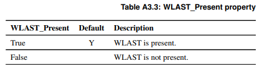

### Write response channel (B)

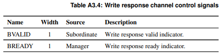

下级设备仅在驱动有效写入响应时才可以断言 **BVALID** 信号。断言后，**BVALID** 必须保持断言状态，直到Master断言 **BREADY** 后的时钟上升沿。

**BREADY** 的默认状态可以为 HIGH，但前提是Master始终可以在单个周期内接受写入响应。

### Read request channel (AR)

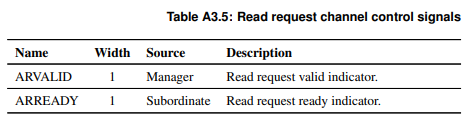

Master仅在驱动有效请求时才可以断言 **ARVALID** 信号。断言后，**ARVALID**必须保持断言状态，直到下级服务器断言 **ARREADY** 信号后的时钟上升沿。

**ARREADY** 的默认状态可以是 **HIGH** 或 **LOW**。建议使用 **HIGH** 作为 **ARREADY** 的默认状态。如果 **ARREADY** 为 **HIGH**，则下级必须能够接受向其呈现的任何有效请求。

不建议将 **ARREADY** 默认为 **LOW**，因为这会强制传输至少需要两个周期，一个周期用于断言 **ARVALID**，另一个周期用于断言 **ARREADY**。

### Read data channel (R)

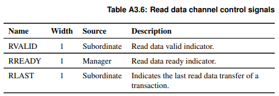

下级设备仅当其在读取数据通道上驱动有效信号时才可以断言 **RVALID** 信号。断言后，**RVALID** 必须保持断言状态，直到管理器断言 **RREADY** 后的上升时钟沿。即使下级设备只有一个读取数据源，它也必须仅在响应请求时断言 **RVALID** 信号。

管理器接口使用 **RREADY** 信号来指示它已接受数据。**RREADY** 的默认状态可以为 **HIGH**，但前提是管理器在启动读取事务时能够立即接受读取数据。

下级在驱动事务中的最终读取传输时必须断言 **RLAST** 信号。

建议将 **RDATA** 驱动为零以用于非活动字节通道。

不使用 **RLAST** 的管理器可以忽略其接口的输入。

属性 **RLAST_Present** 用于确定 RLAST 信号是否存在。

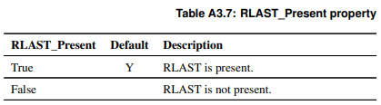

## Relationships between the channels

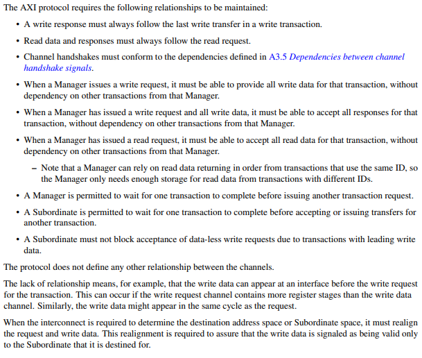

- 写入响应必须始终遵循写入事务中的最后一次写入传输。
- 读取数据和响应必须始终遵循读取请求。
- 通道握手必须符合 A3.5 通道握手信号之间的依赖关系中定义的依赖关系。
- 当管理器发出写入请求时，它必须能够提供该事务的所有写入数据，而不依赖于该管理器的其他事务。
- 当管理器发出写入请求和所有写入数据时，它必须能够接受该事务的所有响应，而不依赖于该管理器的其他事务。
- 当管理器发出读取请求时，它必须能够接受该事务的所有读取数据，而不依赖于该管理器的其他事务。
  - 请注意，管理器可以依赖使用相同 ID 的事务按顺序返回的读取数据，因此管理器只需要足够的存储空间来存储来自具有不同 ID 的事务的读取数据。
- 管理器可以等待一个事务完成后再发出另一个事务请求。
- 下属可以等待一次交互完成后再接受或发出另一次交互。
- 下属不得因具有领先写入数据的交易而阻止接受无数据写入请求。

## Dependencies between channel handshake signals

- Single-headed arrows point to signals that can be asserted before or after the signal at the start of the arrow.
- Double-headed arrows point to signals that must be asserted only after assertion of the signal at the start of the arrow.

### Write transaction dependencies

• The Manager must not wait for the Subordinate to assert AWREADY or WREADY before asserting AWVALID or WVALID. This applies to every write data transfer in a transaction. 

• The Subordinate can wait for AWVALID or WVALID, or both, before asserting AWREADY. 

• The Subordinate can assert AWREADY before AWVALID or WVALID, or both, are asserted. 

• The Subordinate can wait for AWVALID or WVALID, or both, before asserting WREADY. 

• The Subordinate can assert WREADY before AWVALID or WVALID, or both, are asserted. 

• The Subordinate must wait for AWVALID, AWREADY, WVALID, and WREADY to be asserted before asserting BVALID. 

• The Subordinate must also wait for WLAST to be asserted before asserting BVALID. This wait is because the write response, BRESP, must be signaled only after the last data transfer of a write transaction. 

• The Subordinate must not wait for the Manager to assert BREADY before asserting BVALID. 

• The Manager can wait for BVALID before asserting BREADY. 

• The Manager can assert BREADY before BVALID is asserted.

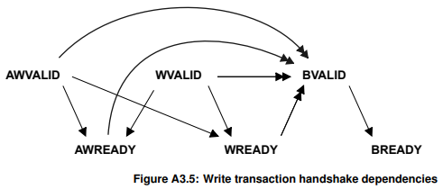

### Read transaction dependencies

For transactions on the read channels, Figure A3.6 shows the handshake signal dependencies. The rules are: 

• The Manager must not wait for the Subordinate to assert ARREADY before asserting ARVALID. 

• The Subordinate can wait for ARVALID to be asserted before it asserts ARREADY. 

• The Subordinate can assert ARREADY before ARVALID is asserted.

• The Subordinate must wait for both ARVALID and ARREADY to be asserted before it asserts RVALID to indicate that valid data is available. 

• The Subordinate must not wait for the Manager to assert RREADY before asserting RVALID. 

• The Manager can wait for RVALID to be asserted before it asserts RREADY. 

• The Manager can assert RREADY before RVALID is asserted.

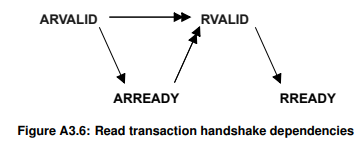

## Snoop channels

DVM messages are transported between interconnect and Manager components using snoop channels. When DVM messages are supported, there is a snoop request channel (AC) and snoop response channel (CR).

### Snoop request channel (AC)

The control signals for the snoop request channel are shown in Table A3.8.

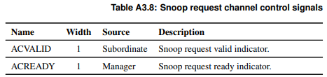

A Subordinate can assert the **ACVALID** signal only when it drives valid address and control information. When asserted, **ACVALID** must remain asserted until the rising clock edge after the Manager asserts the **ACREADY** signal. 

The default state of **ACREADY** can be either **HIGH** or **LOW**. It is recommended to use **HIGH** as the default state for **ACREADY**. If **ACREADY** is **HIGH**, then the Manager must be able to accept any valid request that is presented to it. 

It is not recommended to default **ACREADY** **LOW** because it forces the transfer to take at least two cycles, one to assert **ACVALID** and another to assert **ACREADY**.

### Snoop response channel (CR)

The control signals for the snoop response channel are shown in Table A3.9.

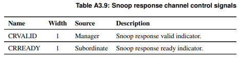

The Manager can assert the **CRVALID** signal only when it drives valid signals on the snoop response channel. When asserted, **CRVALID** must remain asserted until the rising clock edge after the Subordinate asserts **CRREADY**. 

The Subordinate interface uses the **CRREADY** signal to indicate that it accepts the response. The default state of **CRREADY** can be **HIGH**, but only if the Subordinate is able to accept the snoop response immediately when it starts a snoop transaction.

### Snoop transaction dependencies

For transactions on the snoop channels, Figure A15.2 shows the handshake signal dependencies. The rules are:

• The Subordinate must not wait for the Manager to assert **ACREADY** before asserting **ACVALID**. 

• The Manager can wait for **ACVALID** to be asserted before it asserts **ACREADY**. 

• The Manager can assert **ACREADY** before **ACVALID** is asserted. 

• The Manager must wait for both **ACVALID** and **ACREADY** to be asserted before it asserts **CRVALID** to indicate that a valid response is available. 

• The Manager must not wait for the Subordinate to assert **CRREADY** before asserting **CRVALID**. 

• The Subordinate can wait for **CRVALID** to be asserted before it asserts **CRREADY**. 

• The Subordinate can assert **CRREADY** before **CRVALID** is asserted.

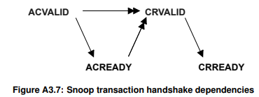


