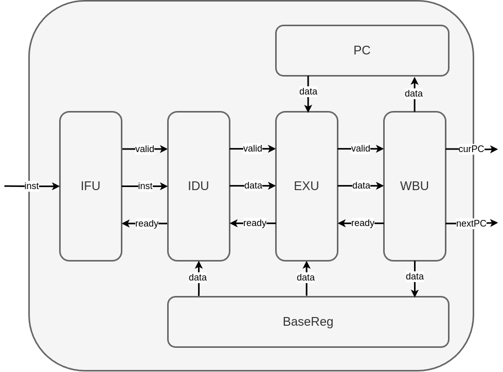

# 重构N P C

## 总体架构

加上总线后的整体架构如下图所示：



由于系统寄存器以及CSR需要与多个模块交互，所以不加入总线通信之中。对于NPC的C语言程序需要对一个输入和两个输出进行控制。

## 模块间交互

总线的交互逻辑如下：

```text
   +-+ valid = 0
   | v         valid = 1
1. idle ----------------> 2. wait_ready <-+
   ^                          |      |    | ready = 0
   +--------------------------+      +----+
              ready = 1
```

具体地:

1. 一开始处于空闲状态idle, 将valid置为无效
   1. 如果不需要发送消息, 则一直处于`idle`状态
   2. 如果需要发送消息, 则将`valid`置为有效, 并进入`wait_ready`状态, 等待slave就绪
2. 在wait_ready状态中, 同时检测slave的ready信号
   1. 如果`ready`信号有效, 则握手成功, 返回`idle`状态
   2. 如果`ready`信号无效, 则继续处于`wait_ready`状态等

### IFU2IDU

IFU与IDU之间需要需要传输的只有指令信号，所以data为指令信号。对于IFU来说，当pc和inst都发生变化时valid有效。对于IDU来说，当valid有效时，ready延迟一个周期有效。

### IDU2EXU

IDU与EXU之间的交互包括两个部分，控制信号和系统寄存器信号，如下表所示。对于IDU来说当与IFU之间的握手成功时，延迟一个周期valid有效。对于EXU来说，当valid有效时，ready延迟一个周期有效。

**数据信号**

- rs1Data[31:0]：rs1字段对应寄存器值。
- rs2Data[31:0]：rs2字段对应寄存器值。
- imm[31:0]：立即数值

**控制信号**

- regWR[0:0]：控制是否对寄存器rd进行写回，为1时写回寄存器，为0不写回。

- srcAALU[1:0]：选择ALU输入端A的来源。为0时选择rs1，为1时选择PC，为2时选择CSR。

- srcBALU[1:0]：选择ALU输入端B的来源。为00时选择rs2，为01时选择imm(当是立即数移位指令时，只有低5位有效)，为10时选择常数4（用于跳转时计算返回地址PC+4）。

- ctrALU[3:0]：选择ALU执行的操作，具体含义参见下表。

- | ctrALU[3] | ctrALU[2:0]} | ALU操作                                                  |
  | --------- | ------------ | -------------------------------------------------------- |
  | 0         | 000          | 选择加法器输出，做加法                                   |
  | 1         | 000          | 选择加法器输出，做减法                                   |
  | ×         | 001          | 选择移位器输出，左移                                     |
  | 0         | 010          | 做减法，选择带符号小于置位结果输出, Less按带符号结果设置 |
  | 1         | 010          | 做减法，选择无符号小于置位结果输出, Less按无符号结果设置 |
  | ×         | 011          | 选择ALU输入B的结果直接输出                               |
  | ×         | 100          | 选择异或输出                                             |
  | 0         | 101          | 选择移位器输出，逻辑右移                                 |
  | 1         | 101          | 选择移位器输出，算术右移                                 |
  | ×         | 110          | 选择逻辑或输出                                           |
  | ×         | 111          | 选择逻辑与输出                                           |

- branch[3:0]：选择跳转的类型，具体含义参见下表。

- | Branch | 跳转类型             |
  | ------ | -------------------- |
  | 0000   | 非跳转指令           |
  | 0001   | 无条件跳转PC目标     |
  | 0010   | 无条件跳转寄存器目标 |
  | 0100   | 条件分支，等于       |
  | 0101   | 条件分支，不等于     |
  | 0110   | 条件分支，小于       |
  | 0111   | 条件分支，大于等于   |
  | 1000   | 异常跳转             |

- toReg[1:0]：选择寄存器rd写回数据来源，为0时选择ALU输出，为1时选择数据存储器输出，为2时选择CSR作为输出。
- memWR[0:0]：控制是否对数据存储器进行写入，为0时不写回，为1时写回存储器。
- memValid[0:0]：控制对存储器操作是否有效，为0时存储器操作无效，为1时操作有效。
- memOP[2:0]：控制数据存储器读写格式，为010时为4字节读写，为001时为2字节读写带符号扩展，为000时为1字节读写带符号扩展，为101时为2字节读写无符号扩展，为100时为1字节读写无符号扩展。
- ecall[0:0]：检测到ecall命令时为1，非ecall时为0。
- mret[0:0]：检测到mret命令时为1，非mret时为0。
- csrEn[0:0]：控制对csr操作是否有效，为0时csr操作无效，为1时操作有效。
- csrWr[0:0]：控制对csr写入，为0时csr不写入，为1时写入。
- csrOP[0:0]：选择CSRALU输入端B的数据来源。为0时选择rs1，为1时选择zimm。
- csrALUOP[1:0]：选择CSRALU的操作。为0时输出两个输入的与非（&～）结果，为1时输出或（|）结果，为2时直接输出B口输入。

### EXU2WBU

EXU与WBU之间的交互包括两个部分，控制信号和系统寄存器信号，如下表所示。对于EXU来说当与WBU之间的握手成功时，延迟一个周期valid有效。对于WBU来说，当valid有效时，ready延迟一个周期有效。

**数据信号**

- memData[31:0]：存储器数据。
- rdData[31:0]：目的寄存器数据。
- csrData[31:0]：csr目的寄存器数据。

**控制信号**

- memWR[0:0]：控制是否对数据存储器进行写入，为0时不写回，为1时写回存储器。
- memValid[0:0]：控制对存储器操作是否有效，为0时存储器操作无效，为1时操作有效。
- memOP[2:0]：控制数据存储器读写格式，为010时为4字节读写，为001时为2字节读写带符号扩展，为000时为1字节读写带符号扩展，为101时为2字节读写无符号扩展，为100时为1字节读写无符号扩展。
- ecall[0:0]：检测到ecall命令时为1，非ecall时为0。
- mret[0:0]：检测到mret命令时为1，非mret时为0。
- csrEn[0:0]：控制对csr操作是否有效，为0时csr操作无效，为1时操作有效。
- csrWr[0:0]：控制对csr写入，为0时csr不写入，为1时写入。

### 