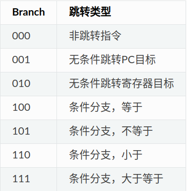
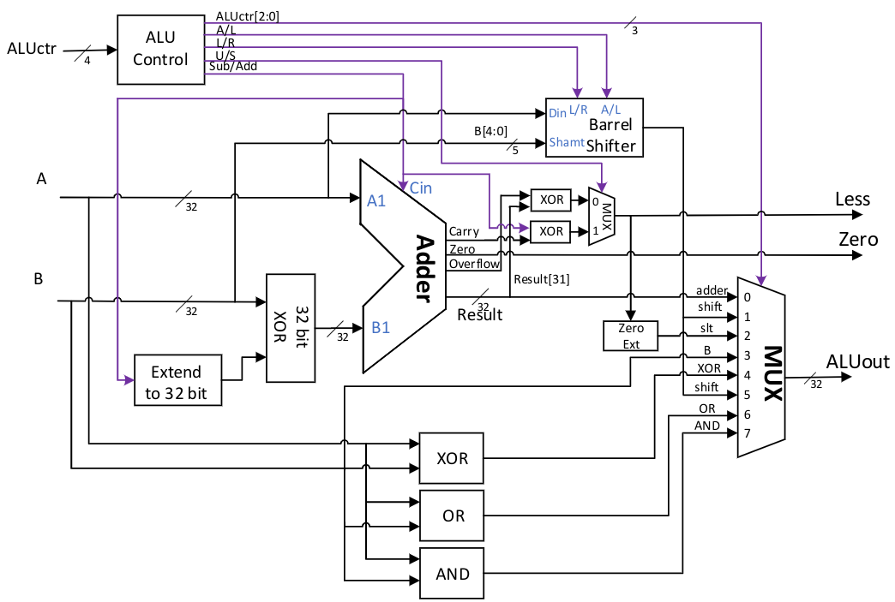

# NPC硬件设计

该设计参考南京大学数字电路实验的架构，使用chisel完成硬件的设计。

硬件部分源码目录如下：

```
├── basemode 	 		 	    // 基础模块生成器
│   ├── BaseALU.scala	       	// 基础计算单元生成器
│   ├── Gate.scala
│   ├── ISA.scala 	 	       	// 操作系统指令相关
│   └── Memory.scala		   	// 存储相关
├── exu
│   ├── alu
│   │   ├── ALUControl.scala   	// ALU控制信号生成模块
│   │   └── ALU.scala 			// ALU计算模块
│   └── EXU.scala 		     	// EXU模块
├── idu 					
│   ├── ContrGen.scala 			// IDU控制信号生成模块
│   ├── IDU.scala 				// IDU主模块
│   └── ImmGen.scala 			// 立即数生成模块
├── ifu
│   └── IFU.scala 				// IFU模块
├── Main.scala 					// 主模块
├── PC.scala					// PC寄存器模块
└── Riscv32BaseReg.scala		// 基础寄存器模块，由于是riscv32e，所以实际工作只有16个寄存器
```

# 总体架构图


# IFU

由于目前指令存储在NPC的C语言程序中，所以目前IFU只起到连线的作用。

## InstrMem

输入信号

- PC[31:0]：输入PC地址，即指令的地址

输出信号

- Instr[31:0]：输出指令，根据PC地址读出的指令

# IDU

IDU负责解析IFU传入的指令生成控制信号和立即数信号，并与基础寄存器模块交互获取其他数据信号。

输入信号：

- **npcState**[5:0]：**RUNNING**, **END**, **ABORT**, **QUIT**, **STOP**, **INIT** 目前状态信号均由C语言端输入，硬件设计部分并不会改变状态
- **cmd**[31:0]：输入命令
- **dataIn**[31:0]：rd输入数据

输出信号：

- **rs1**[31:0]：源寄存器一数据
- **rs2**[31:0]：源寄存器二数据
- **imm**[31:0]：立即数
- 控制信号，具体请看**ContrGen**模块

## ImmGen

IDU会根据指令格式生成5种立即数输入到ImmGen模块，ImmGen模块会对立即数进行位拓展并使用内置的匹配模块分析出指令的类型，并根据指令类型来选择输出的信号。

输入信号：

- **iImm**[11:0]
- **sImm**[11:0]
- **bImm**[12:0]
- **uImm**[31:0]
- **jImm**[20:0]
- **immType**[2:0]：从0到5依序是R、I、S、B、U、J

输出信号：

- **imm**[31:0]：根据immType输出相印的32位立即数

## ContrGen

根据指令中的opcode、func3、fun7 三个字段生成相印的控制信号（有时可能需要根据伪指令生成相应信号通过verilator中的DPI-C机制传输给C语言端）。

ContrGen通过模式·匹配这三个字段判断出具体指令，并根据具体指令输出信号。

输入数据：

- **opcode**[6:0]
- **func3**[2:0]
- **func7**[6:0]
- **cmd**[31:0]

输出信号：

- **immType**[2:0]：立即数类型，输出给ImmGen模块，从0到5依序是R、I、S、B、U、J。

- **regWR**：宽度为1bit，控制是否对寄存器rd进行写回，为1时写回寄存器。

- **srcAALU** ：宽度为1bit，选择ALU输入端A的来源。为0时选择rs1，为1时选择PC。

- **srcBALU**：宽度为2bit，选择ALU输入端B的来源。为00时选择rs2，为01时选择imm(当是立即数移位指令时，只有低5位有效)，为10时选择常数4（用于跳转时计算返回地址PC+4）。

- **ctrALU** [3:0]：宽度为4bit，选择ALU执行的操作，具体含义参见表 [Table 10](https://nju-projectn.github.io/dlco-lecture-note/exp/10.html#tab-aluctr) 。

- | ALUctr[3] | ALUctr[2:0]} | ALU操作                                                  |
  | --------- | ------------ | -------------------------------------------------------- |
  | 0         | 000          | 选择加法器输出，做加法                                   |
  | 1         | 000          | 选择加法器输出，做减法                                   |
  | ×         | 001          | 选择移位器输出，左移                                     |
  | 0         | 010          | 做减法，选择带符号小于置位结果输出, Less按带符号结果设置 |
  | 1         | 010          | 做减法，选择无符号小于置位结果输出, Less按无符号结果设置 |
  | ×         | 011          | 选择ALU输入B的结果直接输出                               |
  | ×         | 100          | 选择异或输出                                             |
  | 0         | 101          | 选择移位器输出，逻辑右移                                 |
  | 1         | 101          | 选择移位器输出，算术右移                                 |
  | ×         | 110          | 选择逻辑或输出                                           |
  | ×         | 111          | 选择逻辑与输出                                           |

- **branch**[2:0]：宽度为3bit，说明分支和跳转的种类，用于生成最终的分支控制信号，含义参见表 [Table 18](https://nju-projectn.github.io/dlco-lecture-note/exp/11.html#tab-branch) 。

  

- **memToReg**：宽度为1bit，选择寄存器rd写回数据来源，为0时选择ALU输出，为1时选择数据存储器输出。

- **memWR**：宽度为1bit，控制是否对数据存储器进行写入，为1时写回存储器。

- **memOP**[2:0]：宽度为3bit，控制数据存储器读写格式，为010时为4字节读写，为001时为2字节读写带符号扩展，为000时为1字节读写带符号扩展，为101时为2字节读写无符号扩展，为100时为1字节读写无符号扩展。

- **ExtOP** :宽度为3bit，选择立即数产生器的输出类型，具体含义参见表 [Table 17](https://nju-projectn.github.io/dlco-lecture-note/exp/11.html#tab-extop) 。

- **RegWr** ：宽度为1bit，控制是否对寄存器rd进行写回，为1时写回寄存器。

- **ALUAsrc** ：宽度为1bit，选择ALU输入端A的来源。为0时选择rs1，为1时选择PC。

- **ALUBsrc** ：宽度为2bit，选择ALU输入端B的来源。为00时选择rs2，为01时选择imm(当是立即数移位指令时，只有低5位有效)，为10时选择常数4（用于跳转时计算返回地址PC+4）。

- **ALUctr** ：宽度为4bit，选择ALU执行的操作，具体含义参见表 [Table 10](https://nju-projectn.github.io/dlco-lecture-note/exp/10.html#tab-aluctr) 。

- **Branch** ：宽度为3bit，说明分支和跳转的种类，用于生成最终的分支控制信号，含义参见表 [Table 18](https://nju-projectn.github.io/dlco-lecture-note/exp/11.html#tab-branch) 。

- **MemtoReg** ：宽度为1bit，选择寄存器rd写回数据来源，为0时选择ALU输出，为1时选择数据存储器输出。

- **MemWr** ：宽度为1bit，控制是否对数据存储器进行写入，为1时写回存储器。

- **MemOP** ：宽度为3bit，控制数据存储器读写格式，为010时为4字节读写，为001时为2字节读写带符号扩展，为000时为1字节读写带符号扩展，为101时为2字节读写无符号扩展，为100时为1字节读写无符号扩展

## Riscv32BaseReg

基本寄存器模块。

输入数据：

- **rs1Index**[4:0]：指令中的rs1寄存器字段
- **rs2Index**[4:0]：指令中的rs2寄存器字段rd
- **rdIndex**[4:0]：指令中的rd寄存器字段
- **dataIn**[31:0]：输入数据
- **regWR**：宽度为1bit，控制是否对寄存器rd进行写回，为1时写回寄存器。

输出数据：

- **rs1Data**[31:0]：源寄存器1数据
- **rs2Data**[31:0]：源寄存器2数据

# EXU

运行模块，根据IDU生成的控制信号对数据信号进行运算操作。

输入信号：

- **pc**[31:0]：输入PC地址

- **rs1Data**[31:0]：源寄存器1数据

- **rs2Data**[31:0]：源寄存器2数据

- **immData**[31:0]：立即数数据

- **aluASrcCtr**：宽度为1bit，选择ALU输入端A的来源。为0时选择rs1，为1时选择PC。

- **aluBSrcCtr**[1:0]：宽度为2bit，选择ALU输入端B的来源。为00时选择rs2，为01时选择imm(当是立即数移位指令时，只有低5位有效)，为10时选择常数4（用于跳转时计算返回地址PC+4）。

- **aluCtr**[3:0]：宽度为4bit，选择ALU执行的操作，具体含义参见表

- | ALUctr[3] | ALUctr[2:0]} | ALU操作                                                  |
  | --------- | ------------ | -------------------------------------------------------- |
  | 0         | 000          | 选择加法器输出，做加法                                   |
  | 1         | 000          | 选择加法器输出，做减法                                   |
  | ×         | 001          | 选择移位器输出，左移                                     |
  | 0         | 010          | 做减法，选择带符号小于置位结果输出, Less按带符号结果设置 |
  | 1         | 010          | 做减法，选择无符号小于置位结果输出, Less按无符号结果设置 |
  | ×         | 011          | 选择ALU输入B的结果直接输出                               |
  | ×         | 100          | 选择异或输出                                             |
  | 0         | 101          | 选择移位器输出，逻辑右移                                 |
  | 1         | 101          | 选择移位器输出，算术右移                                 |
  | ×         | 110          | 选择逻辑或输出                                           |
  | ×         | 111          | 选择逻辑与输出                                           |

- **memOPCtr**[2:0]：宽度为3bit，控制数据存储器读写格式，为010时为4字节读写，为001时为2字节读写带符号扩展，为000时为1字节读写带符号扩展，为101时为2字节读写无符号扩展，为100时为1字节读写无符号扩展

- **memWRCtr**：宽度为1bit，控制是否对数据存储器进行写入，为1时写回存储器。

- **branchCtr**[2:0]：

输出数据：

- **nextPC**[31:0]：下一个PC的地址
- **rdData**[31:0]：目的寄存器地址

## ALU

ALU是CPU中的核心数据通路部件之一，它主要完成CPU中需要进行的算术逻辑运算， 我们在前面的实验中已经实现了一个简单的ALU。在本实验中只需要对该ALU稍加改造即可。 针对RV32I的运算需求，我们对ALU的控制信号进行了重新定义，如表所示。 该ALU的逻辑图如图所示。 ALU对输入数据并行地进行加减法、移位、比较大小、异或等操作。 最终ALUout输出是通过一个八选一选择器选择不同运算部件的结果，选择器的控制端可以用ALUctr[2:0]直接生成。 ALU中其他部件的控制信号包括：A/L控制移位器进行算术移位还是逻辑移位，L/R控制是左移还是右移，U/S控制比较大小是带符号比较还是无符号比较，S/A控制是加法还是减法。 这些控制信号需要按照所需进行的操作对应设置，请同学们自行设计。注意：比较大小或判断相等时应使用减法操作。



| ALUctr[3] | ALUctr[2:0]} | ALU操作                                                  |
| --------- | ------------ | -------------------------------------------------------- |
| 0         | 000          | 选择加法器输出，做加法                                   |
| 1         | 000          | 选择加法器输出，做减法                                   |
| ×         | 001          | 选择移位器输出，左移                                     |
| 0         | 010          | 做减法，选择带符号小于置位结果输出, Less按带符号结果设置 |
| 1         | 010          | 做减法，选择无符号小于置位结果输出, Less按无符号结果设置 |
| ×         | 011          | 选择ALU输入B的结果直接输出                               |
| ×         | 100          | 选择异或输出                                             |
| 0         | 101          | 选择移位器输出，逻辑右移                                 |
| 1         | 101          | 选择移位器输出，算术右移                                 |
| ×         | 110          | 选择逻辑或输出                                           |
| ×         | 111          | 选择逻辑与输出                                           |

### ALU Control

输入信号：

- **aluCtr**[3:0]：alu控制信号输入，000时做加减法，001时做左移位，010时做比较，011输入B的结果直接输出，100时选择异或，101时做算术和逻辑右移，110逻辑或输出，111逻辑与输出

输出信号：

- **aOrL**：A/L控制移位器进行算术移位还是逻辑移位，0为逻辑，1为算术
- **lOrR**：L/R控制是左移还是右移，0为右移，1为左移
- **uOrS**：U/S控制比较大小是带符号比较还是无符号比较，0为带符号比较，1为无符号比较
- **subOrAdd**：S/A控制是加法还是减法，0为加法，1为减法。

### Shifter

输入信号：

- **aOrL**：A/L控制移位器进行算术移位还是逻辑移位，0为逻辑，1为算术

- **lOrR**：L/R控制是左移还是右移，0为右移，1为左移

| aOrL | lOrR | dOut[31] | shiftFillWire |
| :--: | :--: | :------: | :-----------: |
|  0   |  0   |    x     |       0       |
|  0   |  1   |    x     |       0       |
|  1   |  0   |    a     |       a       |
|  1   |  1   |    x     |       0       |

### ALU Adder

ALU加法器模块采用了波纹进位加法器，根据控制信号对加法器进行运算操作，可以实现加减运算并能够输出是否为零（zero）、是否溢出（overflow）、是否进位（carry）。

```scala
class ALUAdder extends Module {
	val io = IO(new Bundle {
		val subOrAdd 	= Input(UInt(1.W))
		val srcAData 	= Input(UInt(32.W))
		val srcBData 	= Input(UInt(32.W))

		val carry 		= Output(UInt(1.W))
		val zero		= Output(UInt(1.W))
		val overflow 	= Output(UInt(1.W))
		val result 		= Output(UInt(32.W))
	})

	val cla32Add 	= Module(new CLAGen(32))
	val subOrAddWire= Cat(Fill(31, io.subOrAdd), io.subOrAdd)
	val aAddWire 	= io.srcAData
	val bAddWire 	= io.srcBData

	cla32Add.io.a 	:= aAddWire
	cla32Add.io.b 	:= bAddWire ^ subOrAddWire
	cla32Add.io.cin := io.subOrAdd
	io.carry 		:= cla32Add.io.cout
	io.zero			:= Mux(cla32Add.io.sum === 0.U, 1.U, 0.U)
	io.overflow		:= (aAddWire(31) === bAddWire(31)) && (cla32Add.io.sum(31) =/= aAddWire(31))
	io.result 		:= cla32Add.io.sum
}
```

## Branch Cond

生成跳转控制信号，用来控制PC Adder模块的下一个周期的PC值的生成。

Branch信号如下：

| Branch | 跳转类型             |
| ------ | -------------------- |
| 000    | 非跳转指令           |
| 001    | 无条件跳转PC目标     |
| 010    | 无条件跳转寄存器目标 |
| 100    | 条件分支，等于       |
| 101    | 条件分支，不等于     |
| 110    | 条件分支，小于       |
| 111    | 条件分支，大于等于   |

代码执行过程中，NextPC可能会有多种可能性：

> - 顺序执行：NextPC = PC + 4；
> - jal： NextPC = PC + imm;
> - jalr： NextPC = rs1 + imm;
> - 条件跳转： 根据ALU的Zero和Less来判断，NextPC可能是PC + 4或者 PC + imm；

在设计中使用一个单独的专用加法器来进行PC的计算。同时，利用了跳转控制模块来生成加法器输入选择。其中，PCAsrc控制PC加法器输入A的信号，为0时选择常数4，为1时选择imm。 PCBsrc控制PC加法器输入B的信号，为0时选择本周期PC，为1时选择寄存器rs1。

## PC Adder

根据Branch Cond模块进行相应的运算生成相应的NextPC信号

| Branch | Zero | Less | PCAsrc | PCBsrc | NextPC    |
| ------ | ---- | ---- | ------ | ------ | --------- |
| 000    | ×    | ×    | 0      | 0      | PC + 4    |
| 001    | ×    | ×    | 1      | 0      | PC + imm  |
| 010    | ×    | ×    | 1      | 1      | rs1 + imm |
| 100    | 0    | ×    | 0      | 0      | PC + 4    |
| 100    | 1    | ×    | 1      | 0      | PC + imm  |
| 101    | 0    | ×    | 1      | 0      | PC + imm  |
| 101    | 1    | ×    | 0      | 0      | PC + 4    |
| 110    | ×    | 0    | 0      | 0      | PC + 4    |
| 110    | ×    | 1    | 1      | 0      | PC + imm  |
| 111    | ×    | 0    | 1      | 0      | PC + imm  |
| 111    | ×    | 1    | 0      | 0      | PC + 4    |
