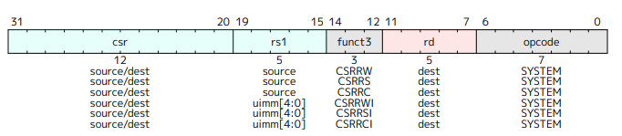
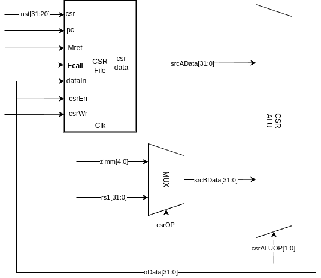

# NPC实现简易异常机制处理

## 标准规定 （unpriv-isa-asciido.pdf 20240411 Chapter 7）

需要添加的指令如下：

- csrrc
- csrrci
- csrrs
- csrrsi
- csrrw
- csrrwi
- ecall
- mret

## 设计

RISCV32E设计如下：

要实现异常处理还需要添加一个CSR模块，该模块用于实现各个异常寄存器。对于前六个命令，cpu需要同时修改基础寄存器和CSR的值，所以要在一个周期内完成对基础寄存器和CSR的赋值，原架构的一个ALU是不足以完成任务的，需要再添加一个ALU用于运算CSR的结果。对于运算CSR结果的CPU并不需要和普通ALU一样的功能，只需要实现一个能完成&～、|的操作即可，添加的CSR模块和CSR ALU如下图所示。

- **csrOP**：宽度为1bit，选择CSRALU输入端B的数据来源。为0时选择rs1，为1时选择zimm。
- **csrALUOP**：宽度为2bit，选择CSRALU的操作。为0时输出两个输入的与非（&～）结果，为1时输出或（|）结果，为2时直接输出B口输入。

ALUAsrc对应的选择器要添加一路CSR模块的输入，MemtoReg对应的选择器也要添加一路CSR模块的输入。

修改后的信号逻辑如下：

- **srcAALU** ：宽度为2bit，选择ALU输入端A的来源。为0时选择rs1，为1时选择PC，为2时选择CSR。

- **memToReg**：宽度为2bit，选择寄存器rd写回数据来源，为0时选择ALU输出，为1时选择数据存储器输出，为2时选择CSR作为输出。

对于后两个命令需要一些特殊处理，对于ecall命令我们需要进行的操作有：

- 将mepc赋值为当前pc地址。
- 将mcause赋值为相应值，目前默认为11。
- 将dnpc赋值为mtvec寄存器中的值。

可以看到需要同时对mepc和mcause赋值，所以对于Ecall需要idu生成一个特定的信号给csr实现为两个寄存器赋值。而最后一个操作可以服用jal的通路，但PCBsrc需要加一路CSR输入，PCAsrc需要加一路输入接地。而Mret可以复用上述通路。修改后的信号逻辑如下：

- **PCAsrc**：宽度为2bit，PC寄存器输入端A的来源。为0时选择4，为1时选择imm，为2时选择0。
- **PCBsrc**：宽度为2bit，PC寄存器输入端B的来源。为0时选择PC，为1时选择rs1，为2时选择csr。

| Branch | 跳转类型             |
| ------ | -------------------- |
| 0000   | 非跳转指令           |
| 0001   | 无条件跳转PC目标     |
| 0010   | 无条件跳转寄存器目标 |
| 0100   | 条件分支，等于       |
| 0101   | 条件分支，不等于     |
| 0110   | 条件分支，小于       |
| 0111   | 条件分支，大于等于   |
| 1000   | 异常跳转             |

## 整体修改

整体的修改如下：

- 添加一个CSR模块和一个CSR ALU模块。
- ALUAsrc对应的选择器要添加一路CSR模块的输入。
- MemtoReg对应的选择器添加一路CSR模块的输入。
- PCAsrc对应的选择器要添加一路接地的输入。
- PCBsrc对应的选择器要添加一路CSR模块的输入。
- Branch添加一种情况。