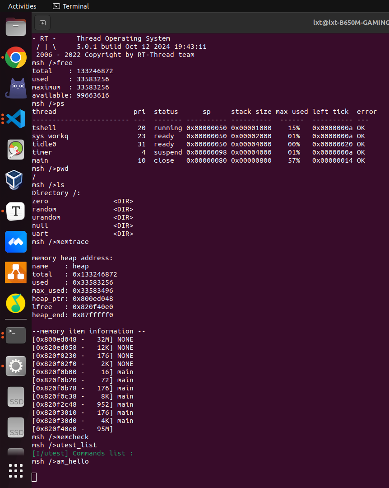

# 0916-1013完成的任务

## NEMU以及AM

- 实现了异常响应机制
- 实现了etrace和Difftest支持异常响应机制
- 实现了上下文切换
- 成功启动RT-Thread

## NPC

- 成功启动RT-Thread
- 使用总线思想重构了NPC（大致完成，还存在bug需要修复）

## PA

- 完成了PA3.1
- 完成了PA4.1

# 存在的问题

## NEMU启动RT-Thread后无法使用内置的Shell命令

## RT-Thread运行时不输出最后的命令提示符的问题

没什么头绪，不知道怎么下手。
